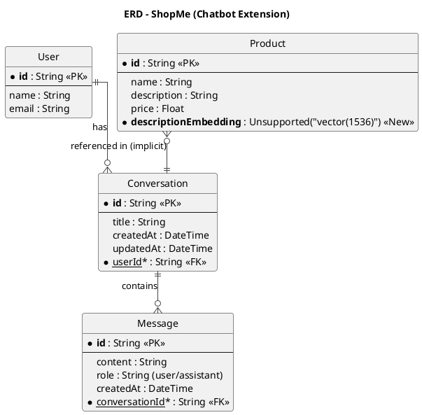
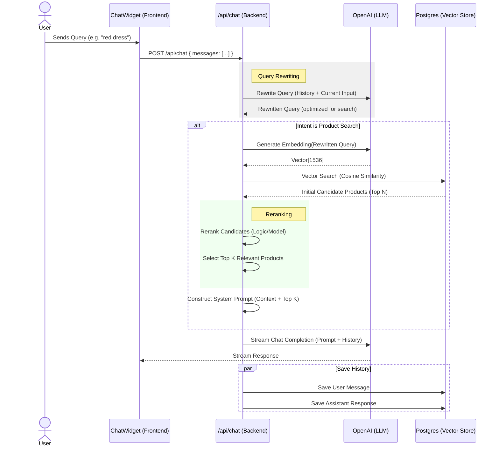

# Chatbot System Design

## 1. Use Cases

The chatbot will serve as an intelligent assistant for customers, providing support and product recommendations.

### 1.1. Product Consultation

- **Actor**: Customer (Logged in or Guest)
- **Goal**: Find products matching specific criteria (e.g., "I need a blue shirt size M").
- **Flow**:
  1. User sends a message describing their need.
  2. Chatbot analyzes the intent and extracts keywords.
  3. Chatbot searches the product catalog using vector similarity search.
  4. Chatbot returns a list of recommended products with links.

### 1.2. General Support

- **Actor**: Customer
- **Goal**: Get answers to general questions (shipping policy, store hours, etc.).
- **Flow**:
  1. User asks a question.
  2. Chatbot uses its knowledge base (system prompt context) to answer.

### 1.3. Conversation Management

- **Actor**: Customer
- **Goal**: View past conversations and continue chatting.
- **Flow**:
  1. User opens the chat widget.
  2. System loads previous messages from the database.
  3. User sends a new message, which is appended to the history.

## 2. Entity Relationship Diagram (ERD)

The following ERD extends the existing system to support the chatbot.

## 3. Sequence Diagram

### 3.1. Chat Flow with Advanced RAG (Rewriting & Reranking)

### 3.2. Embedding & Search Strategy

To ensure accurate product retrieval, we will use the following strategy:

#### **A. Embedding Generation (Indexing)**

We need to convert product data into a format the AI can understand (vectors).

1.  **Data Preparation**: Concatenate relevant fields into a single string.
    - Format: `Product Name: {name}. Category: {category}. Brand: {brand}. Description: {description}. Price: {price}.`
2.  **Vectorization**: Send this string to OpenAI's `text-embedding-3-small` model.
3.  **Storage**: Save the resulting 1536-dimensional vector in the `Product` table column `descriptionEmbedding`.

#### **B. Search Mechanism (Retrieval)**

1.  **Query Embedding**: Convert the user's search query (e.g., "red summer dress") into a vector using the same model.
2.  **Similarity Search**: Use Postgres `pgvector` extension to find products with the closest vectors.
    - SQL: `SELECT * FROM "Product" ORDER BY "descriptionEmbedding" <=> $1 LIMIT 10;`
    - `<=>` represents Cosine Distance (lower is better).
3.  **Filtering**: Apply metadata filters (e.g., price range) if extracted from the intent.

## 4. Advanced Features & Improvements (Future Scope)

To further enhance the chatbot, consider implementing the following features:

### 4.1. Order Tracking Integration

- **Goal**: Allow users to ask "Where is my order?"
- **Implementation**:
  - Add a tool/function `getOrderStatus(userId)` that the LLM can call.
  - The bot can then reply: "Your order #123 is currently **Shipped** and expected to arrive on Friday."

### 4.2. Personalized Recommendations

- **Goal**: Suggest products based on the user's purchase history.
- **Implementation**:
  - When fetching context, also fetch the user's last 5 orders.
  - System Prompt: "User previously bought [Item A, Item B]. Suggest matching items."

### 4.3. Promotion & Voucher Recommendation

- **Goal**: Proactively suggest active vouchers to users to increase conversion.
- **Implementation**:
  - **Context Retrieval**: Fetch active `VoucherCampaign` records from the database.
  - **Logic**:
    - If user asks about a specific product, check if any voucher applies to its category/store.
    - If user is just browsing, suggest general "Shop-wide" or "Platform" vouchers.
  - **Response**: "By the way, we have a 10% off voucher (SAVE10) applicable for this item!"

## 5. Technical Considerations

To ensure robustness and scalability:

### 5.1. Caching

- **Strategy**: Cache embeddings for common queries (e.g., "red dress") in Redis or Vercel KV.
- **Benefit**: Reduces OpenAI API costs and latency.

### 5.2. Security & Privacy

- **Data Access**: Ensure users can ONLY access their own conversations (Row Level Security or API middleware checks).
- **Sanitization**: Sanitize user inputs to prevent prompt injection attacks.

### 5.3. Analytics

- **Metrics**: Track "Conversion Rate" (did the user click a product link?) and "Token Usage" (cost monitoring).
- **Implementation**: Log chat events to a separate analytics table or service (e.g., PostHog).
