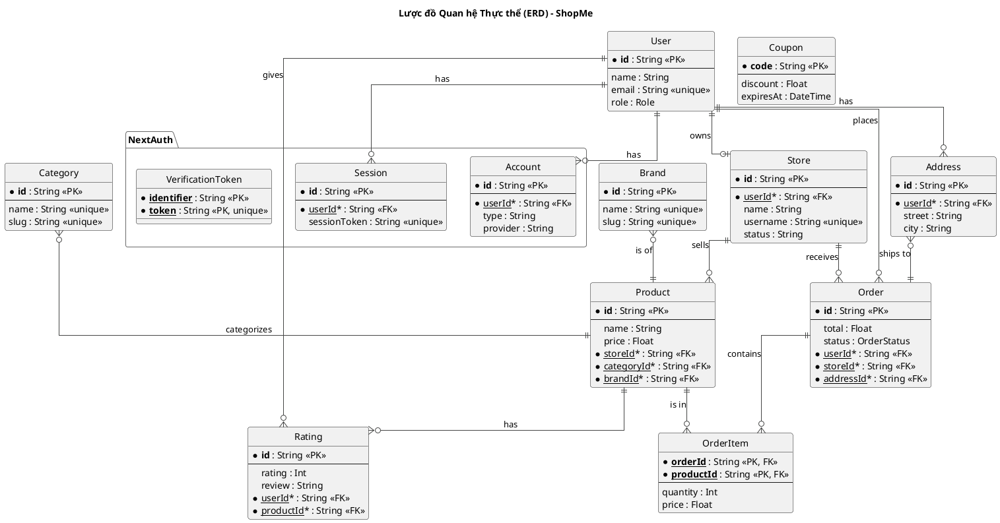

```plantuml
@startuml
!theme vibrant

' hide the spot
hide circle

' avoid problems with angled crows feet
skinparam linetype ortho

title Lược đồ Quan hệ Thực thể (ERD) - ShopMe

' --- Entities Definition ---

entity "User" {
  * **id** : String <<PK>>
  --
  name : String
  email : String <<unique>>
  role : Role
  ' ... other fields
}

entity "Store" {
  * **id** : String <<PK>>
  --
  *<u>userId</u>* : String <<FK>>
  name : String
  username : String <<unique>>
  status : String
  ' ... other fields
}

entity "Product" {
  * **id** : String <<PK>>
  --
  name : String
  price : Float
  *<u>storeId</u>* : String <<FK>>
  *<u>categoryId</u>* : String <<FK>>
  *<u>brandId</u>* : String <<FK>>
  ' ... other fields
}

entity "Category" {
  * **id** : String <<PK>>
  --
  name : String <<unique>>
  slug : String <<unique>>
}

entity "Brand" {
  * **id** : String <<PK>>
  --
  name : String <<unique>>
  slug : String <<unique>>
}

entity "Order" {
  * **id** : String <<PK>>
  --
  total : Float
  status : OrderStatus
  *<u>userId</u>* : String <<FK>>
  *<u>storeId</u>* : String <<FK>>
  *<u>addressId</u>* : String <<FK>>
  ' ... other fields
}

entity "OrderItem" {
  * **<u>orderId</u>** : String <<PK, FK>>
  * **<u>productId</u>** : String <<PK, FK>>
  --
  quantity : Int
  price : Float
}

entity "Address" {
  * **id** : String <<PK>>
  --
  *<u>userId</u>* : String <<FK>>
  street : String
  city : String
  ' ... other fields
}

entity "Rating" {
  * **id** : String <<PK>>
  --
  rating : Int
  review : String
  *<u>userId</u>* : String <<FK>>
  *<u>productId</u>* : String <<FK>>
}

entity "Coupon" {
  * **code** : String <<PK>>
  --
  discount : Float
  expiresAt : DateTime
}

' --- Auth-related Entities ---
package "NextAuth" {
  entity "Account" {
    * **id** : String <<PK>>
    --
    *<u>userId</u>* : String <<FK>>
    type : String
    provider : String
  }
  entity "Session" {
    * **id** : String <<PK>>
    --
    *<u>userId</u>* : String <<FK>>
    sessionToken : String <<unique>>
  }
  entity "VerificationToken" {
    * **<u>identifier</u>** : String <<PK>>
    * **<u>token</u>** : String <<PK, unique>>
  }
}


' --- Relationships Definition ---

User                               ||--o|  Store                 : "owns"
User                               ||--o{ Account               : "has"
User                               ||--o{ Session               : "has"
User                               ||--o{ Address               : "has"
User                               ||--o{ Order                 : "places"
User                               ||--o{ Rating                : "gives"

Store                              ||--o{ Product               : "sells"
Store                              ||--o{ Order                 : "receives"

Category                           }o--|| Product               : "categorizes"
Brand                              }o--|| Product               : "is of"

Order                              ||--o{ OrderItem             : "contains"
Address                            }o--|| Order                 : "ships to"

Product                            ||--o{ OrderItem             : "is in"
Product                            ||--o{ Rating                : "has"

@enduml
```